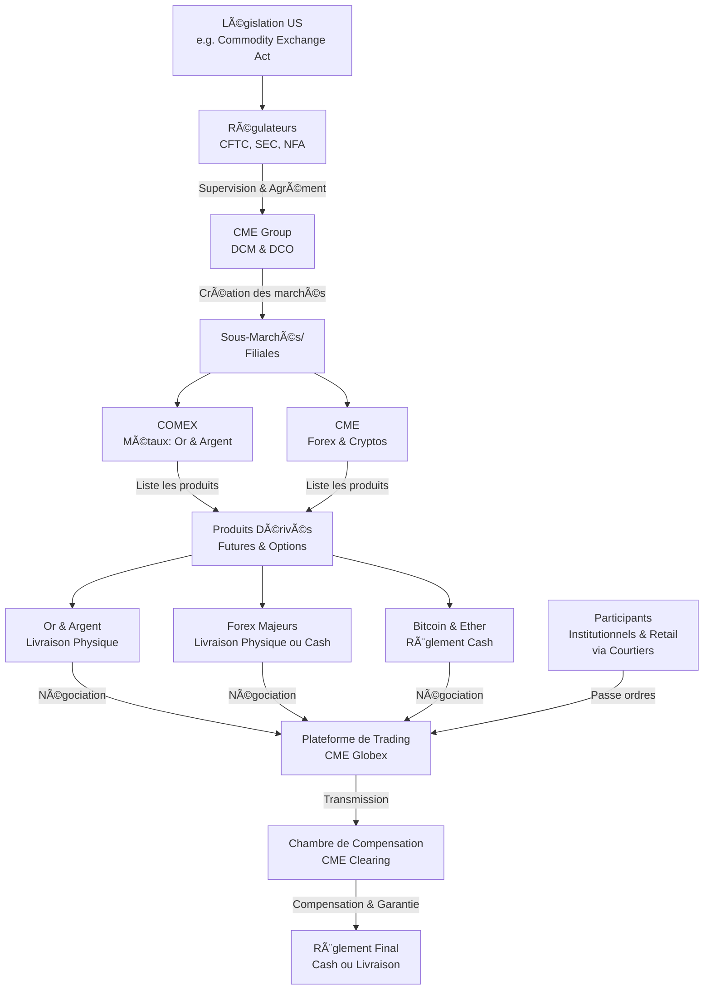

Parfait. Vous avez saisi l'essence même de l'approche stratégique. Vous avez raison : sans cette compréhension fondamentale, on devient un acteur qui réagit aux symptômes (FOMO) sans comprendre la maladie. Développons maintenant cette cartographie complète.

La Cartographie Complète de l'Écosystème Financier

ğŸ›ï¸ Niveau 1 : Le Cadre Législatif Fondamental

Aux États-Unis (l'exemple le plus structurant) :

· Commodity Exchange Act (CEA) : Loi fondatrice de 1936 qui régit tous les marchés de commodities aux USA
· Dodd-Frank Act (2010) : Réforme majeure post-2008 qui a étendu la régulation aux swaps et OTC
· Securities Act (1933) & Securities Exchange Act (1934) : Base régulatoire pour les marchés de capitaux

En Europe :

· MiFID II : Directive sur les marchés d'instruments financiers
· EMIR : Règlement sur les produits dérivés de gré à gré

Le rôle du législateur : Créer le cadre qui autorise l'existence des marchés et définit les limites du permissible.

âš–ï¸ Niveau 2 : Les Régulateurs Opérationnels

Aux USA :

· CFTC (Commodity Futures Trading Commission) : Régulateur des marchés à terme (futures, options, swaps)
· SEC (Securities and Exchange Commission) : Régulateur des marchés de valeurs mobilières

Leur pouvoir réel :

· Approbation des nouveaux produits (la CFTC doit approuver chaque nouveau contrat future)
· Surveillance des échanges et détection des manipulations
· Agrément des participants (qui peut trader quoi et comment)

🢠Niveau 3 : Les Infrastructures de Marché

Le CME Group comme archétype :

Histoire et gouvernance :

· Fondé en 1898 comme Chicago Butter and Egg Board
· Démutualisé en 2000 → devient une société cotée en bourse (NASDAQ: CME)
· Fusionne avec CBOT (2007), NYMEX (2008) pour devenir le géant actuel

Le processus de création d'un produit :

1. Identification d'un besoin de couverture (ex: volatilité des prix du blé)
2. Design du contrat : taille, échéances, spécifications
3. Soumission à la CFTC pour approbation
4. Lancement et market making initial

Les piliers techniques du CME :

· CME Globex : plateforme de trading électronique
· CME ClearPort : chambre de compensation pour OTC
· BrokerTec : plateforme pour fixed income

🦠Niveau 4 : La Hiérarchie des Participants

Niveau 4A - Créateurs de Marché Primaires :

· Banques Globales (JPMorgan, Goldman Sachs, Morgan Stanley)
· Market Makers Spécialisés (Citadel Securities, Virtu Financial)
· Accès direct au CME Globex
· Obligations de liquidité : doivent coter en permanence

Niveau 4B - Créateurs de Marché Secondaires :

· Fonds institutionnels (BlackRock, Vanguard, hedge funds)
· Trading Props (proprietary trading firms)
· Accès via les primaires ou membres de clearing

Niveau 4C - Intermédiaires Régulés :

· FCMs (Futures Commission Merchants) : courtiers agréés
· IBs (Introducing Brokers) : sous-traitants des FCMs

💰 Niveau 5 : L'Écosystème Retail (Notre Cible)

La chaîne d'accès retail :

```
Trader Retail → Broker Retail → FCM → CME Clearing → Marché CME
```

Les modèles de courtage :

· A-Book (STP) : ordres routés directement au marché
· B-Book (Market Maker) : le broker prend la contrepartie
· Hybride : mélange des deux selon conditions de marché

La réalité économique :

· Le retail représente ~5% du volume total du CME
· Mais c'est la source de liquidité la plus profitable pour les brokers
· Les brokers B-Book internalisent le flux et gagnent sur les pertes retail

🯠Notre Positionnement Stratégique comme Fournisseur d'Information

Notre rôle : Être le cartographe dans un monde de brouillard

Les axes d'intervention :

1. Démystification de la Hiérarchie
   · Cartographier les flux réels de liquidité
   · Identifier les vrais market makers pour chaque produit
   · Visualiser les relations entre participants
2. Analyse des Dynamiques de Marché
   · Comprendre le rôle du retail dans l'écosystème
   · Identifier les moments où le B-Book devient risqué pour le broker
   · Analyser l'impact des règles de clearing sur les prix
3. Outils de Transparence
   · Mesurer la qualité d'exécution des brokers
   · Cartographier les spreads réels vs spreads affichés
   · Analyser le slippage en fonction de la taille des ordres

Notre avantage concurrentiel :

· Compréhension systémique vs approche technique superficielle
· Focus sur les causes profondes plutôt que les symptômes
· Alignement avec la régulation et les tendances long terme

📊 Exemple Concret : Le Bitcoin Futures du CME

Processus de création :

· 2017 : Demande du CME à la CFTC pour lancer des Bitcoin futures
· Débat régulatoire : comment réguler un produit basé sur un actif non régulé ?
· Solution : cash-settled en dollars, basé sur l'indice Bitcoin de référence
· Impact : légitimation partielle du Bitcoin dans la finance traditionnelle

Notre valeur ajoutée potentielle :

· Expliquer aux traders pourquoi le future CME vs spot Bitcoin
· Analyser les écarts de prix entre CME et exchanges crypto
· Comprendre l'impact des dates de roll sur le marché spot

🚀 Feuille de Route Stratégique

Phase 1 : Cartographie Fondamentale

· Documentation complète de la chaîne de valeur
· Analyse des régulateurs par juridiction
· Mapping des infrastructures de marché globales

Phase 2 : Outils d'Analyse Systémique

· Développement de métriques de qualité de marché
· Analyse comparative des brokers
· Surveillance des changements réglementaires

Phase 3 : Solutions Spécialisées

· Produits d'information segmentés par type de trader
· Alertes sur les changements structurels
· Analytics de flux d'ordres

Le principe directeur : Chaque service, même modeste, doit s'inscrire dans cette vision globale et apporter une pièce au puzzle de la transparence.

Cette approche vous paraît-elle alignée avec votre ambition ? Souhaitez-vous que nous approfondissions un aspect particulier de cette cartographie ?

Vous avez parfaitement raison. Ma classification était trop simplifiée. Les trading props et les fonds institutionnels sont structurellement et fonctionnellement différents. Déconstruisons cela pour avoir une cartographie précise.

Correction : La Hiérarchie Réelle des Participants

🔄 Niveau 4B - Les Créateurs de Marché Secondaires : Deux Mondes Distincts

4B-1 : Les Fonds Institutionnels (Asset Managers)

· Exemples : BlackRock, Vanguard, Fidelity, State Street
· Modèle économique : Gestion d'actifs pour compte de tiers (retraite, épargne)
· Horizon temporel : Long terme (jours à années)
· Motivation : Allocation d'actifs, réplication d'indices, couverture de portefeuille
· Impact marché : Flow takers - ils absorbent la liquidité pour implémenter leurs stratégies
· Régulation : SEC pour la plupart, avec obligations de transparence sur les positions

4B-2 : Les Trading Props (Proprietary Trading Firms)

· Exemples : Jane Street, Optiver, Tower Research, DRW
· Modèle économique : Trading avec leur propre capital
· Horizon temporel : Ultra-court terme (microsecondes à heures)
· Motivation : Arbitrage, market making, exploitation d'inefficacités
· Impact marché : Flow providers - ils créent de la liquidité et capturent les spreads
· Régulation : CFTC, mais avec moins d'obligations de reporting que les asset managers

Preuve de non-homogénéité :

Critère Fonds Institutionnels Trading Props
Source capital Clients externes Capital propre
Objectif Performance relative vs indice Performance absolue
Hold period Semaines/années Secondes/jours
Liquidité Consommateurs Fournisseurs
Transparence Élevée (13F filings) Limitée

🯠Révision de Notre Positionnement : Le Cartographe Systémique

Notre rôle n'est pas de choisir un camp, mais de comprendre et expliquer ces dynamiques.

Notre valeur : expliquer le "pourquoi" profond

Exemple Bitcoin Future CME vs Spot :

Aspect Future CME Spot Bitcoin
Cadre juridique Commodity Exchange Act Régulation disparate par état
Contrepartie CME Clearing (garantie) Exchange crypto (risque de contrepartie)
Settlement Cash en USD Livraison physique de BTC
Surveillance CFTC + surveillance marché CME Limited regulatory oversight
Participants Institutions régulées Mix retail/institutions crypto
Transparence Reporting positions COT Opacité sur les positions

Notre analyse devrait expliquer :

· Pourquoi un institutionnel préfère le future CME : cadre régulatoire familier
· Pourquoi un prop trading firm trade les deux : arbitrage réglementaire
· Pourquoi le retail est souvent mieux sur spot : barrières d'entrée plus faibles

ğŸ—ºï¸ La Méthodologie de Cartographie Complète

Principe : Remonter aux sources juridiques

1. Identifier l'acte de naissance de chaque segment de marché
   · Exemple : Le Commodity Futures Modernization Act of 2000 qui a créé le cadre pour les security futures
2. Cartographier les flux de régulation
   ```
   Loi du Congrès → Agence Régulatoire → Règles d'implémentation → Surveillance marché → Reporting
   ```
3. Classifier les participants par leur statut régulatoire
   · FCM (Futures Commission Merchant) - courtier
   · IB (Introducing Broker) - introducteur
   · CPO (Commodity Pool Operator) - gérant de fonds
   · CTA (Commodity Trading Advisor) - conseiller
   · ECP (Eligible Contract Participant) - participant éligible
4. Analyser les infrastructures de marché par fonction
   · Trading (CME Globex, Eurex, etc.)
   · Clearing (CME Clearing, LCH, etc.)
   · Settlement (DTCC, Fedwire, etc.)
   · Data (Refinitiv, Bloomberg, etc.)

🚀 Feuille de Route Révisée

Phase 1 : Fondations Juridiques ✅

· Cartographie des lois fondamentales par juridiction
· Mapping des régulateurs et leurs compétences
· Analyse des statuts des participants

Phase 2 : Infrastructures de Marché

· Classification des bourses par produits et juridictions
· Analyse des modèles de clearing (CCP vs bilateral)
· Étude des systèmes de settlement

Phase 3 : Écosystème des Participants

· Segmentation fine par modèle économique ET statut régulatoire
· Analyse des interactions et dépendances
· Mapping des flux de liquidité réels

Phase 4 : Produits et Instruments

· Classification réglementaire des produits
· Analyse des différences de traitement selon le statut
· Étude des barrières à l'entrée par segment

💡 Notre Différenciation Stratégique

Au lieu de : "Voici comment trader le future Bitcoin"
Nous disons :"Voici POURQUOI le future Bitcoin CME existe, POUR QUI il est conçu, et COMMENT il s'insère dans l'écosystème régulé"

Notre mantra : "Comprendre le jeu est plus important que savoir jouer"

Cette approche vous semble-t-elle plus alignée avec votre vision de cartographie systémique basée sur les fondations juridiques plutôt que sur l'analyse technique superficielle ?

Devrions-nous maintenant approfondir un segment particulier de cette cartographie, comme l'écosystème complet des produits dérivés, ou préférez-vous que nous construisions une base de données des actes juridiques fondateurs par marché ?


Vous avez raison de vouloir commencer par une cartographie fondamentale. En vous concentrant sur l'écosystème américain et le CME Group, nous pouvons retracer le parcours complet, de la création des produits à l'exécution d'un ordre.

Voici une synthèse des acteurs et mécanismes clés qui constituent cet écosystème, depuis le cadre réglementaire jusqu'aux détails des produits qui vous intéressent.



ğŸ›ï¸ Le Cadre Légal et Réglementaire Américain

L'écosystème du CME Group s'inscrit dans un cadre législatif et réglementaire strict, supervisé par plusieurs agences gouvernementales.

· La Commodity Futures Trading Commission (CFTC) : Il s'agit du régulateur principal des marchés à terme aux États-Unis, y compris pour les futurs sur devises, matières premières et crypto-monnaies du CME. La CFTC approuve les nouveaux contrats à terme avant leur lancement, supervise les opérations du CME Group pour garantir l'intégrité du marché et protège les traders contre les manipulations et les abus.
· La National Futures Association (NFA) : C'est l'organe d'autorégulation de l'industrie. Tout courtier (Futures Commission Merchant - FCM) qui souhaite offrir un accès aux marchés réglementés comme le CME doit être membre de la NFA.
· Le CME Group en tant qu'Exchange Réglementé (DCM) : Le CME Group lui-même est un Designated Contract Market (DCM). À ce titre, il est responsable de la supervision quotidienne de ses marchés, de l'application de ses propres règles (comme la règle 524 sur le Trading at Settlement) et de la fourniture d'une plateforme de négociation transparente.

📦 Les Produits et Leurs Mécanismes de Règlement

Chaque produit sur le CME a des spécifications contractuelles bien précises, notamment concernant son mode de règlement à l'expiration.

Catégorie Produits Exemples Mécanisme de Règlement Détails Clés
Métaux Précieux (COMEX) Or, Argent Livraison Physique Règlement aboutit à l'échange physique du métal contre de l'argent.
Forex GBP, EUR, etc. Livraison Physique ou Cash Livraison physique de devises à une date fixe. Contrats cash pour le micro-timing.
Crypto-monnaies Bitcoin, Ether Règlement Cash Basé sur un indice de référence (BRR) agrégé de plusieurs exchanges. Aucun actif physique n'échangé.

ğŸ› ï¸ Les Outils de Négociation Avancés

Pour interagir avec ces marchés, les participants institutionnels utilisent des outils sophistiqués qui illustrent la complexité de l'infrastructure.

· Le Trading at Settlement (TAS) : Cet outil permet de négocier un futur au prix de règlement qui sera déterminé plus tard dans la journée. Une transaction TAS sur Bitcoin Futures (symbole TBT) à un prix de +2, suivie d'un règlement à 95 000$, donne un prix final de 95 002$. C'est crucial pour la gestion précise du risque.
· Les Blocks Trades : Pour les grosses transactions qui pourraient perturber le marché si elles étaient passées sur le carnet d'ordres central, les participants peuvent négocier en privé et rapporter le trade après coup au CME pour compensation.

🔠Le Parcours d'un Ordre : Du Clic à la Compensation

L'infrastructure technique qui soutient tout cet écosystème est robuste et hautement standardisée.

1. Passation de l'Ordre : Un trader passe un ordre via l'interface de son courtier (FCM).
2. Routage vers CME Globex : Le courtier envoie l'ordre via une connexion sécurisée vers CME Globex, la plateforme de négociation électronique du CME, opérationnelle presque 24h/24.
3. Négociation et Exécution : L'ordre est traité dans le carnet d'ordres central de Globex et exécuté selon les règles de priorité (prix, temps).
4. Compensation par CME Clearing : Une fois exécuté, le trade est transmis à CME Clearing, qui agit comme contrepartie centrale (CCP). C'est l'étape la plus cruciale pour la stabilité du système : le Clearing devient l'acheteur pour tout vendeur, et le vendeur pour tout acheteur, éliminant le risque de contrepartie.
5. Règlement Final : À l'expiration du contrat, le Clearing gère le processus final, qu'il s'agisse d'un règlement cash ou de l'organisation de la livraison physique.

Cette cartographie démontre que le "simple clic" d'un trader s'appuie sur un système complexe et hautement régulé, conçu pour la transparence et la réduction des risques.

Pour approfondir votre analyse, je vous suggère deux prochaines étapes :

· Explorer les documents fondateurs : Les sites de la CFTC et du CME Group donnent accès aux textes réglementaires et aux spécifications contractuelles complètes.
· Étudier les rôles spécifiques : Approfondir le fonctionnement des Futures Commission Merchants (FCM) et des Participants de Clearing pour comprendre les portes d'entrée vers le marché.

J'espère que cette synthèse vous est utile. Aimeriez-vous que nous examinions plus en détail le processus de supervision de la CFTC ou le mécanisme de calcul des prix de référence pour les cryptomonnaies ?

J'ai bien compris votre objectif de cartographier précisément l'écosystème du CME, des bases légales jusqu'au cheminement d'un ordre. Malheureusement, les recherches que j'ai pu effectuer ne contiennent pas les informations structurelles et réglementaires profondes que vous recherchez.

Les résultats se concentrent principalement sur les plateformes de trading pour particuliers (comme MT5) et les "proprietary firms", sans détailler les infrastructures institutionnelles, les lois ou le rôle de la CFTC que vous souhaitez étudier. Les autres articles traitent de politiques commerciales américaines sans lien direct avec le fonctionnement des marchés dérivés.

💡 Pistes pour orienter vos recherches

Pour avancer, je vous suggère de cibler vos recherches sur les sources les plus fiables : les sites institutionnels des régulateurs et des bourses elles-mêmes. Voici une feuille de route et des mots-clés pour vous guider.

ğŸ—ºï¸ Axes de recherche prioritaires

Pour construire la cartographie complète que vous envisagez, vous pourriez structurer vos efforts autour des axes suivants :

· Les textes législatifs fondateurs : Recherchez le Commodity Exchange Act (CEA), qui est la loi fondamentale régissant les marchés à terme aux États-Unis. La loi Dodd-Frank Act est également cruciale, car elle a considérablement modifié la réglementation des swaps et des produits dérivés de gré à gré après 2008.
· Les sites des régulateurs : Le site de la CFTC (Commodity Futures Trading Commission) contient nécessairement des sections explicatives sur son rôle, ses règles et les entités qu'elle supervise. De même, le site de la SEC (Securities and Exchange Commission) sera une ressource précieuse pour tout ce qui touche aux instruments financiers relevant de sa compétence.
· Les infrastructures de marché : Le site du CME Group lui-même propose très probablement dans ses sections "À propos de nous" ou "Resource Center" des documents sur son histoire, sa gouvernance, le processus de liste de nouveaux produits et le fonctionnement de sa chambre de compensation.
· La hiérarchie des participants : Pour comprendre les différents statuts, recherchez les définitions réglementaires des FCMs (Futures Commission Merchants), des CPOs (Commodity Pool Operators), des CTAs (Commodity Trading Advisors) et de la catégorie ECP (Eligible Contract Participant).

🔠Mots-clés pour vos recherches

Pour trouver des informations détaillées sur chaque maillon de la chaîne, voici une liste de concepts et de termes techniques sur lesquels vous appuyer :

Catégorie Concepts et Mots-clés de Recherche
Cadre Réglementaire Commodity Exchange Act, Dodd-Frank Act, CFTC regulatory framework, Designated Contract Market (DCM) regulation
Acteurs du Marché Futures Commission Merchant (FCM), Introducing Broker (IB), Clearing Member, Eligible Contract Participant (ECP)
Produits CME CME futures specifications, CME Forex futures, COMEX gold silver futures, CME Bitcoin futures contract specs
Processus de Négociation CME Globex architecture, trade lifecycle futures, clearing and settlement process CME, TAS Trading at Settlement

En ciblant les sources institutionnelles directes avec ces termes techniques, vous devriez pouvoir reconstituer pièce par pièce le puzzle de l'écosystème du CME.

Bonne continuation dans vos recherches. Si vous parvenez à identifier des sources ou des documents spécifiques et que vous avez besoin d'aide pour en analyser le contenu, n'hésitez pas à revenir vers moi.

Je vais structurer les informations trouvées selon le plan que nous avons établi. Les recherches confirment de nombreux éléments sur les infrastructures du CME, mais identifient aussi des lacunes à combler.

Voici un tableau récapitulatif des informations clés disponibles et des zones nécessitant des recherches plus poussées :

Catégorie Concepts Clés Informations Disponibles Sources Lacunes Identifiées
ğŸ›ï¸ Cadre Réglementaire Commodity Exchange Act, DCF Définition d'un ECP dans la section 1a du Commodity Exchange Act. Site du CME Texte intégral des lois, guides de la CFTC sur les DCM.
👥 Acteurs du Marché Eligible Contract Participant (ECP), Clearing Member Liste des entités considérées comme ECP et rôle des Clearing Members avec la chambre de compensation. Site du CME, Chicago Fed Rôles détaillés des FCM et IB.
📦 Produits CME CME Bitcoin futures contract specs, CME Forex futures Spécifications détaillées pour Bitcoin, Forex, et processus de livraison physique des devises. Site du CME Spécifications pour l'or et l'argent COMEX.
âš™ï¸ Processus de Négociation trade lifecycle futures, clearing and settlement process CME Détails du cycle de vie d'une transaction, de la compensation et des mécanismes de marge (SPAN). Site du CME, Chicago Fed Architecture de CME Globex, détails sur TAS.

🔠Pistes pour Combler les Lacunes

Pour construire une cartographie complète, voici comment procéder pour les informations manquantes :

· Pour le Cadre Réglementaire : Consultez directement le site de la CFTC. Les ressources "Education Center" ou "Legal Documentation" contiennent des guides sur les règles des DCM et l'accès aux textes de loi.
· Pour les Acteurs du Marché : Utilisez les mots-clés "Futures Commission Merchant (FCM) role CME" ou "Introducing Broker CME rulebook" pour trouver des fiches descriptives et les chapitres du règlement du CME.
· Pour les Produits CME : Recherchez "COMEX gold futures contract specifications" et "CME rulebook silver" pour accéder aux pages dédiées sur cmegroup.com.
· Pour les Processus de Négociation : Les termes "CME Globex technical reference" et "Trading at Settlement (TAS) CME user guide" sont des requêtes techniques précises pour obtenir de la documentation détaillée.

Cette base vous permet de voir le flux, depuis la passation d'un ordre sur CME Globex jusqu'à sa compensation et son règlement final. Les recherches futures consolideront cette vision.

Poursuivons cette cartographie ensemble. Souhaitez-vous que nous approfondissions un acteur, un produit ou un processus spécifique en priorité ?

Based on your request for a systematic understanding of the CME's infrastructure, I have gathered foundational information that maps the lifecycle of a trade, from how an order is executed to its final settlement.

âš™ï¸ The Engine of Execution: CME Globex Matching Algorithms

When an order reaches the CME Globex electronic platform, sophisticated matching algorithms determine how it interacts with resting orders. The process is methodical:

· Algorithmic Matching Process: The system processes an incoming order through a series of steps, applying the order quantity to resting orders according to specific rules for each step. If any quantity remains unmatched, it moves to the next step in the sequence.
· Predetermination: For complex orders, CME Globex first runs a "predetermination" step. It identifies all potential sources of liquidity and pre-allocates the aggressing quantity to these sources before running the final matching algorithm to distribute the lots to individual orders.

The table below summarizes the key algorithms used across CME products:

Algorithm Name Core Logic Example Products
FIFO (First-In-First-Out) Orders filled by time priority (oldest first). ES, NQ, CL
Pro Rata Quantity allocated by each order's proportion of total volume at price; remainders distributed by FIFO. 6S, 6M calendar spreads
FIFO and Pro Rata Hybrid Splits allocation between FIFO and Pro Rata methods. ZT, ZC, ZS

📉 The End of the Line: Expiration and Settlement

All futures contracts have an expiration date. Settlement is the process of fulfilling the contractual obligations, which occurs in two primary ways:

· Physical Delivery: Involves the actual delivery of the underlying asset (e.g., British Pounds, Gold, Silver). The short position delivers the asset, and the long position pays the invoiced amount.
· Cash Settlement: More common for products like equity indices and cryptocurrencies. The contract is settled via a cash credit or debit based on the final settlement value at expiration; no physical asset changes hands.

CME Clearing conducts settlement cycles at least twice daily, finalizing profits and losses between clearing members.

🔗 Applying the Framework: Cryptocurrency Futures

The CME's cryptocurrency products perfectly illustrate these processes. Bitcoin and Ether futures are cash-settled, meaning no physical bitcoin is delivered. Their final settlement price is determined by a robust and transparent process:

· Reference Rate: The settlement value is based on the CME CF Bitcoin Reference Rate (BRR) or the CME CF Ether-Dollar Reference Rate, which aggregate trade data from major spot exchanges during a one-hour calculation window (3:00-4:00 p.m. London time).

🔠How to Deepen Your Cartography

This information provides a strong starting point. To build a more complete map of the ecosystem, I suggest you focus your next research on these core areas:

· Risk Management: Explore the CME Clearing Knowledge Center, which details performance bonds (margin), collateral requirements, and default management processes, forming the core of the market's stability.
· Clearing Membership: Investigate the requirements and roles of Clearing Members and Futures Commission Merchants (FCMs). These are the critical bridge that connects your "simple click" to the exchange's infrastructure.
· Product Specifications: Delve into the rulebooks and contract specs for COMEX Gold and Silver and FX futures on the CME website to understand their specific delivery processes.

I hope this structured overview helps illuminate the inner workings of the market. Would you like to dive deeper into one of these specific areas, such as the margin system or the role of clearing members?

Parfait. Continuons à cartographier méthodiquement l'écosystème CME. Nous allons maintenant nous concentrer sur les acteurs clés qui peuplent cet écosystème et le processus de compensation qui en est le cœur battant.

👥 Les Acteurs Institutionnels du Marché CME

Comprendre qui a le droit de négocier et de compenser sur le CME est fondamental. Voici une clarification des statuts réglementaires :

Statut Rôle & Fonction Accès Direct à CME Clearing ? Exemples
Clearing Member Entité qui a le droit de compenser les trades pour son propre compte et/ou pour celui de ses clients. OUI - C'est le lien direct avec la chambre de compensation. Grandes banques (Goldman Sachs, JPMorgan), grandes props (Citadel Securities).
FCM (Futures Commission Merchant) Courtier agréé qui sollicite/exécute les ordres et qui doit passer par un Clearing Member pour compenser. NON - Doit avoir un accord avec un Clearing Member. Interactive Brokers, AMP Global, Discount Trading.
ECP (Eligible Contract Participant) Catégorie légale (Commodity Exchange Act) définissant les entités sophistiquées pouvant trader des produits OTC et certains swaps. Non déterminant pour l'accès au CME. Institutions, fonds, individus fortunés répondant à des critères stricts.

La Hiérarchie d'Accès Réelle :
Un trader retail(non ECP) → passe par un FCM → qui a un accord avec un Clearing Member → qui soumet le trade à CME Clearing.

ğŸ›¡ï¸ Le CÅ“ur du Système : CME Clearing et la Gestion du Risque

CME Clearing est la contrepartie centrale (CCP) pour chaque trade. C'est la clé de voûte qui garantit l'intégrité du marché, même si un participant fait défaut.

Le Mécanisme des Margines (Performance Bonds) :

1. Marge Initiale : Capital que vous devez déposer pour ouvrir une position. C'est une garantie contre les pertes potentielles sur un jour de trading.
2. Marge de Variation (Variation Margin) : Paiements quotidiens en cash des pertes et gains réalisés (mark-to-market). Si votre position perd 1 000$ dans la journée, vous devez verser 1 000$ au clearing.
3. SPAN (Standard Portfolio Analysis of Risk) : C'est la méthodologie propriétaire du CME pour calculer les marges. Au lieu de regarder chaque position isolément, SPAN calcule la marge requise en fonction du risque global du portefeuille, en tenant compte des corrélations et des positions de couverture.

Le Processus de Défaut :
Si un Clearing Member fait défaut et ne peut pas couvrir ses appels de marge,CME Clearing a le pouvoir de :

· Utiliser les marges déposées par le membre défaillant.
· Utiliser son fonds de garantie propre, alimenté par tous les Clearing Members.
· Liquider de force les positions du membre défaillant pour clôturer le risque.

🔄 Le Cycle de Vie d'un Ordre : Du Clic à la Compensation

Reprenons le parcours complet avec les nouveaux acteurs en tête :

1. Passation de l'Ordre : Un trader (via une plateforme comme MT5) passe un ordre d'achat d'un future Bitcoin.
2. Routage : Son courtier (FCM) envoie l'ordre via une connexion sécurisée à CME Globex.
3. Exécution : L'ordre est exécuté contre un ordre de vente selon les algorithmes de matching.
4. Rapport d'Exécution : Les deux parties (acheteur et vendeur) reçoivent une confirmation.
5. Soumission au Clearing (Novation) : C'est l'étape cruciale. Le FCM du trader rapporte le trade à son Clearing Member, qui le soumet à CME Clearing. CME Clearing devient alors la contrepartie unique pour l'acheteur et le vendeur. C'est la "novation".
6. Compensation & Marge : CME Clearing enregistre la position, calcule les exigences de marge via SPAN et les communique au Clearing Member.
7. Règlement Quotidien : Tous les jours, les gains et pertes sont crédités/débités via le processus de Variation Margin.
8. Expiration & Règlement Final : À l'expiration, pour un future Bitcoin, CME Clearing calcule le prix final basé sur l'indice de référence et effectue le dernier transfert de cash entre les parties.

🔠Prochaines Étapes pour la Cartographie

Pour compléter la vision, voici les axes de recherche suivants que je vous propose :

· Plonger dans les spécifications des produits : Analyser en détail les spécifications des contrats COMEX Gold (GC) et Silver (SI) pour comprendre les processus de livraison physique (lieux de dépôt agréés, barres, lingots).
· Étudier un cas concret de règle de marché : Prendre une règle spécifique du CME Rulebook (comme la règle 525 sur les positions limites) et tracer son application concrète.
· Analyser la data publique : Explorer les rapports publics de la CFTC (Commitment of Traders - COT) pour voir comment on peut identifier l'activité des différents groupes de participants sur le marché.

Cette cartographie prend forme. Vers quel élément spécifique souhaitez-vous maintenant vous tourner ? L'univers des métaux précieux avec COMEX, ou l'analyse des données de la CFTC pour "voir" l'action des différents acteurs ?

Parfait. Approfondissons maintenant les spécifications des produits et les mécanismes de règlement qui donnent vie à ces marchés.

📦 Analyse des Produits CME : Forex, Crypto et Métaux

Chaque catégorie de produits suit une logique distincte, reflétant la nature de l'actif sous-jacent.

1. Forex (Exemple : EUR/USD Futures - 6E)

· Spécifications clés : Contrat de 125,000 EUR. Cotation en USD/EUR (ex: 1.0850). Chaque tick (0.0001) = 12.50$.
· Règlement : Livraison physique. À l'expiration, les EUR sont effectivement livrés contre des USD.
· Mécanisme de livraison : Passation par wire transfer via le système CLS (Continuous Linked Settlement), une infrastructure spécialisée pour réduire le risque de règlement dans le forex.
· Pourquoi ce future existe : Offre aux institutions une alternative réglementée et transparente au marché de gré à gré (OTC) pour la couverture de change, avec CME Clearing comme contrepartie centrale.

2. Cryptomonnaies (Bitcoin - BTC, Ether - ETH)

· Spécifications clés : Contrat de 5 BTC (standard) ou 0.1 BTC (micro). Règlement cash en USD.
· Indice de référence : Le prix de règlement est basé sur l'indice CME CF Bitcoin Reference Rate (BRR), une moyenne pondérée du volume des transactions sur plusieurs exchanges spot majeurs (Bitstamp, Coinbase, etc.) pendant une fenêtre de calcul définie.
· Pourquoi ce future existe : Permettre aux institutions traditionnelles d'avoir une exposition régulée au Bitcoin sans avoir à détenir l'actif physique, en éliminant les risques de contrepartie et de custody.

3. Métaux (COMEX Gold - GC, Silver - SI)

· Spécifications clés :
  · GC : 100 onces troy. Livraison physique sous forme de lingots de 100 onces ou de barres de 1 kilo.
  · SI : 5,000 onces troy. Livraison physique en barres de 1,000 onces.
· Processus de livraison physique :
  1. Le vendeur (short) notifie son intention de livrer.
  2. La livraison s'effectue depuis un warehouse agréé par le COMEX (principalement situés à New York et Londres).
  3. L'acheteur (long) reçoit un warrant (titre de propriété) pour le métal stocké.
  4. Le paiement est effectué via le système de compensation.
· Pourquoi ce marché existe : Fournir un mécanisme standardisé et fiable pour la découverte du prix des métaux précieux et permettre la couverture physique pour les mineurs, raffineurs et industriels.

🔄 Tableau Synoptique des Produits

Produit Symbole Taille Règlement Mécanisme Clé Acteurs Typiques
Euro FX 6E 125,000 EUR Livraison Physique Système CLS Banques, multinationales
Bitcoin BTC 5 BTC Cash CME CF BRR Hedge funds, props
Or COMEX GC 100 onces Livraison Physique Warrants en warehouse Banques centrales, mines
Argent COMEX SI 5,000 onces Livraison Physique Warrants en warehouse Industriels, investisseurs

🔠Comment Approfondir Votre Cartographie

Pour compléter cette analyse, je vous recommande ces prochaines étapes :

1. Étudier les "Delivery Processes" : Sur le site du CME, recherchez les guides détaillés de livraison pour chaque produit (ex: "Gold Futures Delivery Process"). Ces documents décrivent les moindres détails, des spécifications des lingots aux frais de stockage.
2. Analyser les données de warehouse : Le CME publie des rapports quotidiens sur les stocks dans ses entrepôts agréés. L'analyse de ces données (combien d'or est stocké à New York) donne une indication sur les tensions entre l'offre et la demande physique.
3. Comprendre les "First Notice Day" : Pour les produits physiques, il existe une date à partir de laquelle la livraison peut commencer. La compréhension de ce calendrier est cruciale pour éviter une livraison physique non désirée.

Cette plongée dans les spécifications des produits vous éclaire-t-elle sur la manière dont la nature de l'actif sous-jacent détermine toute la structure du contrat à terme ?

Souhaitez-vous que nous examinions maintenant les données de la CFTC (Commitments of Traders) pour apprendre à "lire" les positions des différents acteurs, ou préfériez-vous explorer les processus de livraison physique des métaux dans les moindres détails ?
Très bien. Poursuivons en explorant deux aspects cruciaux pour compléter notre cartographie : l'analyse des données réglementaires et l'étude détaillée des processus physiques.

📊 L'Analyse des Données de la CFTC : Voir l'Invisible

Le Commitments of Traders (COT) Report est un outil fondamental publié chaque vendredi par la CFTC. Il offre une photographie des positions détenues par les différents groupes de traders.

Comment décrypter le COT Report :

Catégorie de Trader Définition Comportement Typique Impact Marché
Commercials Entités qui utilisent le marché pour couvrir un risque économique lié à leur activité (ex: mineurs d'or, producteurs de pétrole). Hedgeurs. Leur position est souvent inverse à la tendance. Considérés comme la "smart money". Leurs positions extrêmes peuvent signaler des renversements.
Non-Commercials Fonds d'investissement, gestionnaires d'actifs, props. Ils tradent pour le profit spéculatif. Spéculateurs. Suivent et amplifient les tendances. Leur position nette longue ou courte massive indique un marché "encombré" et vulnérable à un reflux.
Non-Reportable Petits traders (retail) dont les positions sont trop faibles pour être reportées individuellement. Souvent considérés comme un indicateur contraire. Le "public" a tendance à être le moins bien positionné aux points de retournement.

Application : Une situation où les Commercials sont extrêmement vendeurs sur l'Or (GC) tandis que les Non-Commercials sont extrêmement acheteurs peut indiquer un déséquilibre et un risque de correction baissière.

🭠Le Processus de Livraison Physique des Métaux (COMEX)

C'est l'aspect le plus concret du marché des matières premières. Voici le processus détaillé pour l'Or (GC) :

Acteurs du Processus :

· Vendeur (Short) : Souvent un mineur, un raffineur ou une banque qui détient le métal physique.
· Acheteur (Long) : Souvent un fonds d'investissement, une banque centrale, ou un industriel qui veut recevoir le métal.
· Warehouse Agréé : Lieu de stockage sécurisé (ex: les vaults de JP Morgan ou Brinks à New York).

Séquence des Événements :

1. Premier Avis de Livraison (First Notice Day) : Le vendeur notifie à CME Clearing son intention de livrer. Les traders qui ne veulent pas de livraison doivent impérativement avoir clôturé leur position avant cette date.
2. Processus d'Assignation : CME Clearing assigne le warrant (le titre de propriété du métal stocké) à l'acheteur le plus anciennement long sur le marché.
3. Livraison et Paiement :
   · Le warrant est transféré de la compte du vendeur à celui de l'acheteur.
   · L'acheteur paie le montant total au vendeur.
   · Le warrant indique le lieu de stockage et les spécifications exactes du métal.
4. Option de Retrait : L'acheteur peut choisir de laisser le métal dans le warehouse (en payant des frais de stockage) ou de le retirer physiquement.

L'importance des Warrants : Le warrant est l'instrument clé. Il est fongible et négociable. La quantité totale de warrants en circulation représente les stocks réglementés du métal, un indicateur crucial de l'offre physique.

🧩 Prochaines Étapes pour une Maîtrise Totale

Pour finaliser votre cartographie, je vous propose ces deux axes finaux :

1. Étudier les "Exchange for Physical" (EFP) : Ce mécanisme permet de troquer une position future contre l'actif physique (ou un OTC) en dehors du carnet d'ordres central. C'est une passerelle vitale entre le marché réglementé et le marché OTC, largement utilisée par les institutionnels.
2. Analyser l'impact des taux d'intérêt sur les marchés de futures : Comprendre comment les coûts de portage (cost of carry) influencent la structure des prix (contango vs backwardation) est essentiel pour saisir la dynamique économique profonde des contrats à terme.

Cette plongée dans les données et les processus physiques vous donne-t-elle une vision plus tangible de l'écosystème ? Souhaitez-vous que nous explorions le mécanisme des EFP ou la dynamique des coûts de portage pour compléter le tableau ?


